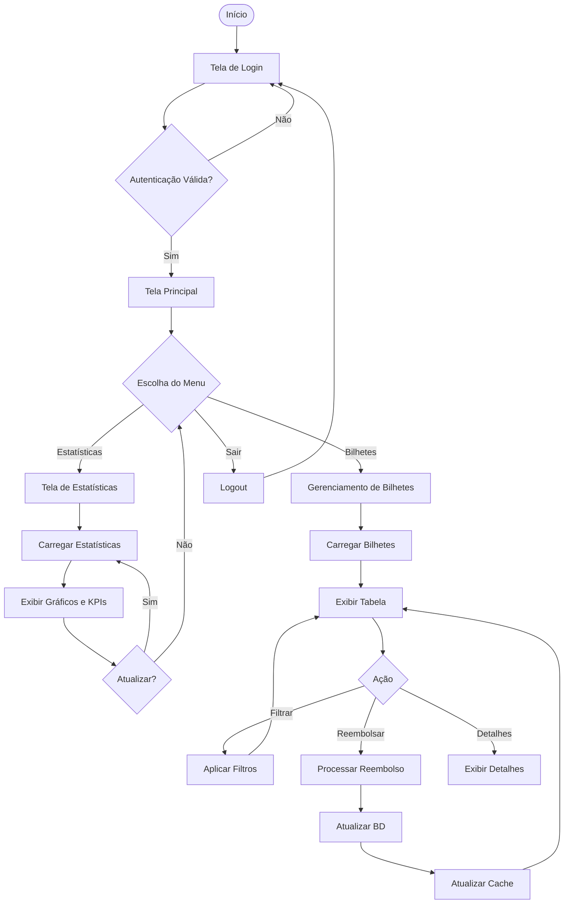
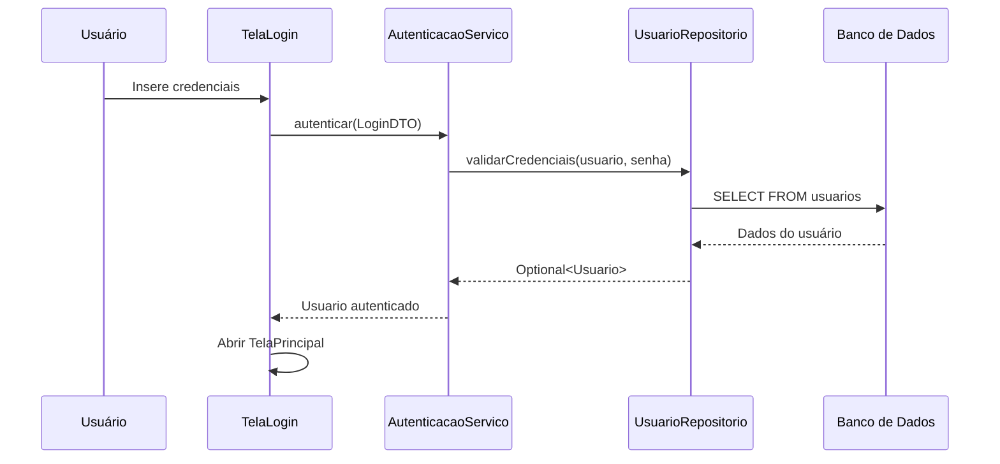
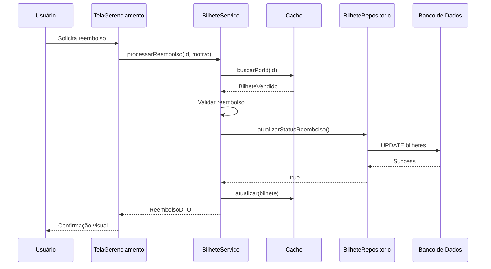

# Sistema Administrativo Teatro ABC

## 📋 Visão Geral

O Sistema Administrativo Teatro ABC é uma aplicação desktop desenvolvida em Java utilizando Swing para gerenciamento de bilhetes vendidos e análise de estatísticas de vendas de um teatro. O sistema permite controle de reembolsos, visualização de dados analíticos e gestão administrativa completa.

## 🏗️ Arquitetura do Sistema

### Arquitetura Hexagonal (Ports and Adapters)

O projeto implementa a Arquitetura Hexagonal, separando a lógica de negócio das tecnologias externas:

```
┌─────────────────────────────────────────────────────────────┐
│                    INFRAESTRUTURA UI                        │
│  ┌─────────────────────────────────────────────────────┐   │
│  │  Swing UI (Telas, Componentes)                      │   │
│  └─────────────────────────┬───────────────────────────┘   │
│                            │                                │
│  ┌─────────────────────────▼───────────────────────────┐   │
│  │         APLICAÇÃO (Casos de Uso)                    │   │
│  │  ┌─────────────────────────────────────────────┐   │   │
│  │  │  Serviços: Bilhete, Estatística, Auth       │   │   │
│  │  │  DTOs: Login, Reembolso, Estatística        │   │   │
│  │  └─────────────────────┬───────────────────────┘   │   │
│  │                        │                            │   │
│  │  ┌─────────────────────▼───────────────────────┐   │   │
│  │  │         DOMÍNIO (Core Business)             │   │   │
│  │  │  Entidades: BilheteVendido, Usuario         │   │   │
│  │  │  Interfaces: IRepositorioBilhete            │   │   │
│  │  │  Enums: StatusReembolso, TipoUsuario        │   │   │
│  │  └─────────────────────┬───────────────────────┘   │   │
│  │                        │                            │   │
│  └────────────────────────┼────────────────────────────┘   │
│                           │                                 │
│  ┌────────────────────────▼────────────────────────────┐   │
│  │         INFRAESTRUTURA PERSISTÊNCIA                 │   │
│  │  Repositórios, Cache, Conexão DB                    │   │
│  └─────────────────────────────────────────────────────┘   │
└─────────────────────────────────────────────────────────────┘
```

### Estrutura de Diretórios

```
src/main/java/com/teatroabc/admin/
├── Main.java                           # Ponto de entrada da aplicação
├── aplicacao/                          # Camada de Aplicação
│   ├── dto/                           # Data Transfer Objects
│   │   ├── EstatisticaDTO.java
│   │   ├── LoginDTO.java
│   │   └── ReembolsoDTO.java
│   ├── interfaces/                    # Portas de entrada
│   │   ├── IAutenticacaoServico.java
│   │   ├── IBilheteServico.java
│   │   └── IEstatisticaServico.java
│   └── servicos/                      # Implementação dos casos de uso
│       ├── AutenticacaoServico.java
│       ├── BilheteServico.java
│       └── EstatisticaServico.java
├── dominio/                           # Camada de Domínio (Core)
│   ├── entidades/                    # Entidades de negócio
│   │   ├── BilheteVendido.java
│   │   ├── EstatisticaPeca.java
│   │   └── Usuario.java
│   ├── enums/                        # Enumerações
│   │   ├── StatusReembolso.java
│   │   └── TipoUsuario.java
│   └── interfaces/                   # Portas de saída
│       ├── IAutenticacao.java
│       └── IRepositorioBilhete.java
└── infraestrutura/                   # Camada de Infraestrutura
    ├── persistencia/                 # Acesso a dados
    │   ├── cache/
    │   │   └── CacheBilhetes.java   # Cache em memória
    │   ├── conexao/
    │   │   └── ConexaoDB.java       # Gerenciamento de conexão
    │   └── implementacao/           # Implementação dos repositórios
    │       ├── BilheteRepositorio.java
    │       └── UsuarioRepositorio.java
    └── ui_swing/                    # Interface gráfica
        ├── componentes/             # Componentes reutilizáveis
        │   ├── GraficoBarras.java
        │   ├── PainelFiltros.java
        │   └── TabelaBilhetes.java
        ├── telas/                   # Telas da aplicação
        │   ├── TelaEstatisticas.java
        │   ├── TelaGerenciamentoBilhetes.java
        │   ├── TelaLogin.java
        │   └── TelaPrincipalAdmin.java
        └── util/                    # Utilitários
            ├── ConstantesUI.java
            └── ValidadorCampos.java
```

## 🔄 Fluxo do Sistema

### Fluxograma Principal



### Fluxo de Autenticação



### Fluxo de Reembolso



## 🎯 Princípios SOLID Implementados

### 1. **Single Responsibility Principle (SRP)**
Cada classe tem uma única responsabilidade:
- `BilheteServico`: Gerencia operações de bilhetes
- `EstatisticaServico`: Calcula estatísticas
- `ConexaoDB`: Gerencia conexões com banco
- `CacheBilhetes`: Gerencia cache em memória

### 2. **Open/Closed Principle (OCP)**
Classes abertas para extensão, fechadas para modificação:
- Interfaces de serviço permitem novas implementações sem alterar código existente
- `IRepositorioBilhete` pode ter diferentes implementações (MySQL, PostgreSQL, etc.)

### 3. **Liskov Substitution Principle (LSP)**
Subtipos são substituíveis por seus tipos base:
- Qualquer implementação de `IBilheteServico` pode ser usada onde a interface é esperada
- DTOs são imutáveis, garantindo comportamento consistente

### 4. **Interface Segregation Principle (ISP)**
Interfaces específicas e coesas:
- `IBilheteServico`: Operações de bilhetes
- `IEstatisticaServico`: Operações de estatísticas
- `IAutenticacaoServico`: Operações de autenticação

### 5. **Dependency Inversion Principle (DIP)**
Dependências de abstrações, não implementações:
- Serviços dependem de interfaces de repositório
- UI depende de interfaces de serviço
- Injeção de dependências no construtor

## 🎨 Padrões de Projeto Utilizados

### 1. **Singleton Pattern**
```java
public class CacheBilhetes {
    private static volatile CacheBilhetes instancia;
    
    public static CacheBilhetes getInstance() {
        if (instancia == null) {
            synchronized (CacheBilhetes.class) {
                if (instancia == null) {
                    instancia = new CacheBilhetes();
                }
            }
        }
        return instancia;
    }
}
```
- Garante instância única do cache
- Thread-safe com double-checked locking

### 2. **Repository Pattern**
```java
public interface IRepositorioBilhete {
    List<BilheteVendido> buscarTodos();
    Optional<BilheteVendido> buscarPorId(String id);
    boolean salvar(BilheteVendido bilhete);
}
```
- Abstrai acesso a dados
- Permite trocar implementação de persistência

### 3. **DTO (Data Transfer Object) Pattern**
```java
public class ReembolsoDTO {
    private final boolean sucesso;
    private final String mensagem;
    private final LocalDateTime dataReembolso;
    private final BigDecimal valorReembolsado;
}
```
- Transferência de dados entre camadas
- Objetos imutáveis

### 4. **Service Layer Pattern**
- Serviços encapsulam lógica de negócio
- Coordenam operações entre repositórios e cache

### 5. **Observer Pattern (Implícito)**
- Listeners Swing para eventos de UI
- `ListSelectionListener` para seleção na tabela

### 6. **Strategy Pattern (Implícito)**
- Diferentes estratégias de busca (por ID, CPF, peça)
- Renderizadores customizados para células da tabela

### 7. **Template Method Pattern**
- `paintComponent` em `GraficoBarras`
- Estrutura padrão com passos customizáveis

### 8. **Service Locator Pattern**
```java
public static class ServiceLocator {
    private static IBilheteServico bilheteServico;
    private static IEstatisticaServico estatisticaServico;
    
    public static void inicializar(...) { }
    public static IBilheteServico getBilheteServico() { }
}
```
- Centraliza acesso aos serviços
- Evita passar dependências por múltiplas camadas

## 🚀 Funcionalidades Principais

### 1. **Autenticação**
- Login com usuário e senha
- Controle de sessão
- Diferenciação entre admin e funcionário

### 2. **Gerenciamento de Bilhetes**
- Visualização em tabela paginada
- Filtros por ID, CPF e peça
- Processamento de reembolsos com motivo
- Detalhes completos do bilhete

### 3. **Estatísticas e Dashboard**
- KPIs em tempo real (vendas, reembolsos, taxas)
- Gráficos de barras interativos
- Análise por peça e turno
- Atualização automática

### 4. **Cache e Performance**
- Cache em memória para bilhetes
- Sincronização com banco de dados
- Índices por CPF e peça
- Operações thread-safe

## 💾 Banco de Dados

### Estrutura Principal
- **Tabela `bilhetes`**: Armazena vendas de ingressos
- **Tabela `usuarios`**: Usuários administrativos
- **View `vw_bilhetes`**: Visão consolidada para consultas

### Configuração
- Arquivo: `src/main/resources/database.properties`
- Driver: MySQL Connector/J
- Pool de conexões não implementado (possível melhoria)

## 🛠️ Tecnologias Utilizadas

- **Java 17**: Linguagem principal
- **Swing**: Interface gráfica desktop
- **MySQL**: Banco de dados relacional
- **Maven**: Gerenciamento de dependências
- **JDBC**: Acesso a dados

## 📦 Dependências

```xml
<dependency>
    <groupId>mysql</groupId>
    <artifactId>mysql-connector-java</artifactId>
    <version>8.0.33</version>
</dependency>
```

## 🔧 Configuração e Execução

1. **Pré-requisitos**
   - Java 17 ou superior
   - MySQL 8.0 ou superior
   - Maven 3.6 ou superior

2. **Configuração do Banco**
   - Criar banco de dados `teatro`
   - Executar scripts de criação de tabelas
   - Configurar credenciais em `database.properties`

3. **Compilação**
   ```bash
   mvn clean compile
   ```

4. **Execução**
   ```bash
   mvn exec:java -Dexec.mainClass="com.teatroabc.admin.Main"
   ```


## 👥 Contribuição

Para contribuir com o projeto:
1. Fork o repositório
2. Crie uma branch para sua feature
3. Commit suas mudanças
4. Push para a branch
5. Abra um Pull Request

## 📄 Licença

Este projeto é propriedade do Teatro ABC. Todos os direitos reservados.
